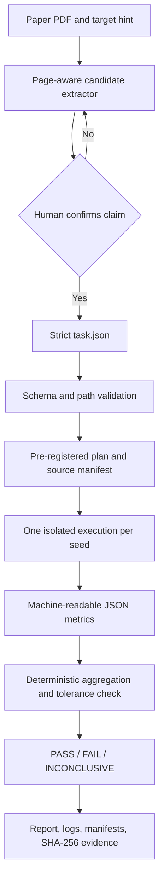

# Architecture

For a directory-by-directory reading order and ownership map, see
[CODE_REVIEW_GUIDE.md](CODE_REVIEW_GUIDE.md).

## Design objective

ReproAgent-Lite is built around one principle: language models may help interpret evidence
and propose work, but only deterministic code may issue a scientific verdict.

The MVP separates five concerns:

1. **Claim intake** — locate numeric candidates near a target hint and retain page/table
   evidence.
2. **Pre-registration** — validate and freeze the expected metric, aggregation, seeds, and
   tolerance before any experiment runs.
3. **Execution** — run one attempt per seed using either a restricted Docker container or an
   explicitly acknowledged local fixture backend.
4. **Verification** — read finite numeric values from JSON, aggregate them, and apply the
   registered tolerance without a model call.
5. **Evidence reporting** — persist plans, source hashes, execution records, raw logs,
   metrics, verdict math, and a human-readable report.

## Data flow

## Modules

| Module | Responsibility |
|---|---|
| `models.py` | Strict domain model and JSON validation |
| `paper.py` | Optional PDF text extraction and conservative claim discovery |
| `llm.py` | Optional Responses API claim structuring; never verdict logic |
| `security.py` | Path confinement, command validation, sanitized environment |
| `runner.py` | Local fixture and restricted Docker execution backends |
| `hashing.py` | Stable file and source-tree SHA-256 hashing |
| `verifier.py` | Metric parsing, aggregation, and tolerance decision |
| `workflow.py` | Stateful orchestration and artifact persistence |
| `report.py` | Human-readable evidence report |
| `cli.py` | `validate`, `run`, `demo`, `extract`, and `doctor` commands |

## State transitions

The persisted state progresses through `PREPARING → PREPARED → RUNNING → REPORTED`. A
completed attempt has its own execution record even when the process fails or times out.
The final scientific state is separate:

- `PASS`: enough seeds succeeded and the aggregate meets the registered tolerance.
- `FAIL`: enough seeds succeeded and the aggregate misses the tolerance.
- `INCONCLUSIVE`: fewer than the registered minimum number of seeds produced usable metrics.

This distinction prevents infrastructure failures from being misreported as scientific
failures.

## Determinism and provenance

- Task JSON rejects unknown and duplicate fields.
- The source manifest records the normalized source-tree hash and immutable repository
  metadata supplied by the task.
- Every attempt receives one explicit `REPRO_SEED` and a separate output directory.
- The experiment must emit a finite numeric metric in JSON; stdout scraping is not used.
- Aggregation and tolerance are selected before execution.
- The verdict contains both absolute and relative errors, successful seed count, and hashes
  of the artifacts used to reach it.

Runtime duration and generated timestamps are naturally non-deterministic. They are retained
as operational evidence but are not inputs to the verdict.

## Trust boundaries

Paper text and repository content are untrusted. Paper text cannot instruct the model, and
repository commands are represented as argument arrays executed with `shell=False`.
Workspace-relative paths are resolved and rejected if they escape their allowed root.

The local backend is intentionally named `unsafe-local` in evidence records. Only the Docker
backend can set `independent_isolation: true`, and even that flag means the configured
container boundary was used—not that hostile code is mathematically safe.

## Extension points

New backends implement the `ExperimentRunner` protocol. Metric adapters should produce the
same finite numeric interface rather than adding model judgment to verification. Autonomous
repair should be a proposal/approval loop whose accepted patch is hashed into a new source
manifest before rerunning.
